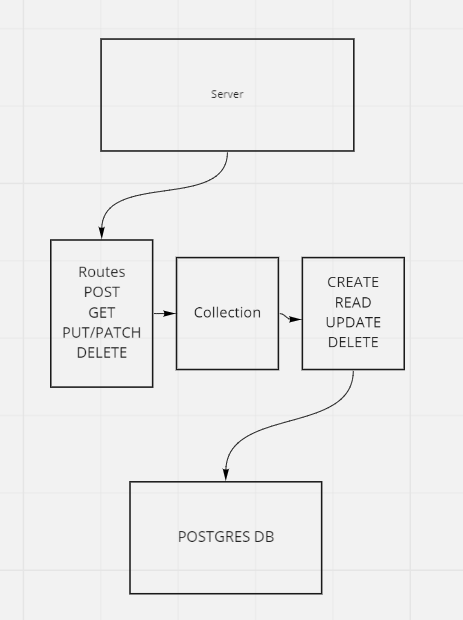

# api-server

An API server to be hosted on Heroku. Uses PostGres DB to store two schemas of data.

This one has games (title and release year) and people (names and year of birth).

## Installation

to install run `git@github.com:ryanyinlee/api-server.git`

`cd` basic-api-server

run `npm init -y`

`npm i dotenv express jest lint node pg router routes sequelize sequelize-cli sqlite3 supertest`

## Usage

`npm start` to run server

`npm test` to test server in terminal

## Routes

CRUD is identical for games and people.

**Games**

- router.get('/game', read)
- router.get('/game/:id', read)
- router.post('/game', create)
- router.patch('/game/:id', update)
- router.delete('/game/:id', remove)

**People**

- router.get('/people', read)
- router.get('/people/:id', read)
- router.post('/people', create)
- router.patch('/people/:id', update)
- router.delete('/people/:id', remove)

## Current Deploys/GitHub Repository

GitHubRepository

https://github.com/ryanyinlee/api-server

Dev Branch:

https://ryanyinlee-api-server.herokuapp.com/

Main/Production - Due to Heroku limitations this hasn't been used. Just running dev.

https://ryanyinlee-api-server.herokuapp.com/

## UML

